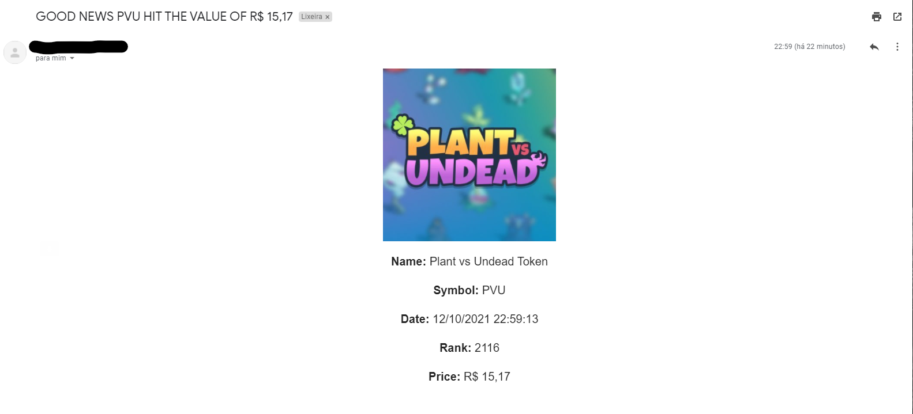

## Installation of dependencies

Install [NodeJS](https://nodejs.dev/) on your machine and run the commands below.

- Command to enter folder
```cmd
cd pvu-price-monitor
```

- Install dependency command
```cmd
npm install
```

## Settings

Rename the ***.env-example*** file to ***.env*** and enter the desired settings.

```env
# Config

# Example: 1h,1d,7d,30d,365d,ytd
CFG_INTERFAVAL=1h

# Example: USD
CFG_CURRENCY=BRL

# Example: example@email.com
CFG_NOTIFICATION_EMAIL=

# Example: 3.40
CFG_NOTIFICATION_PRICE=

# Example: 10000 = 10s
CFG_CHECK_TIME=10000

# Mail Configuration

# Default Value:
MAIL_HOST=

# Default Value:
MAIL_PORT=

# Default Value:
MAIL_USER=

# Default Value:
MAIL_PASSWORD=

# Default Value:
MAIL_SECURE=

# Default Value:
MAIL_SERVICE=

# Default Value:
MAIL_TLS_REJECT=
```

## Starting Project

To start the project and very simple, after it is configured, execute the command below. If you have configured email to notify, receive an email when the desired value is reached.

```cmd
npm start
```

## Console Output Example

```log
🍀 PVU: R$ 15,30 - 12/10/2021 23:18:54
🍀 PVU: R$ 15,30 - 12/10/2021 23:19:04
🍀 PVU: R$ 15,30 - 12/10/2021 23:19:14
🍀 PVU: R$ 15,28 - 12/10/2021 23:19:25
```

## E-mail Output Example


